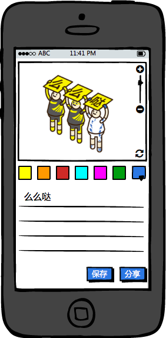

### 描述
此项目的目的是 通过此项目的开发，快速学习使用react框架 所准备的学习教程

### 所学技术
react

### 项目描述
一个举牌小人的简单应用，通过输入文字，动态的刷新出来在举牌子的小人图片，每个小人在举牌，牌子上为每一个字

输入方式 支持 空格、回车
操作方式 支持 放大缩小、拖拽、换背景颜色、文字颜色等操作
其他内容 支持 分享、下载

### 教学计划
1.搭建环境和框架
2.对整体进行组件划分
3.实现组件＊＊的开发
4.整合组件
//此时项目已经可以使用了
5.使用redux做数据层
6.使用router增加列表页
7.总结与回顾

### 图片资源
在 ** ../design/res/img ** 里
